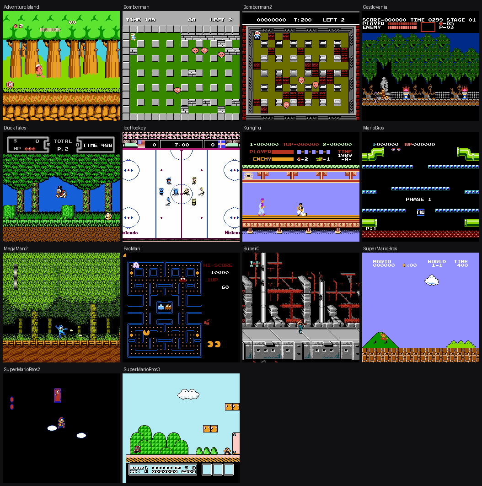
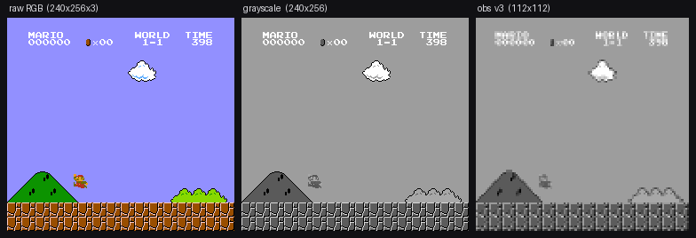
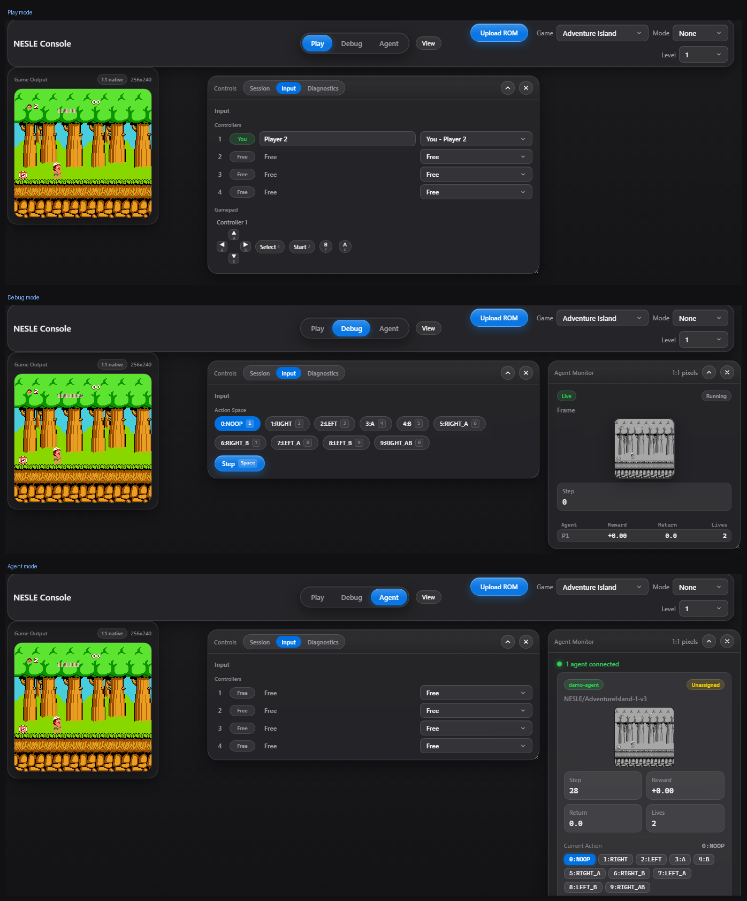

# NESLE — NES Learning Environment

[](https://github.com/tooichitake/nesle/actions/workflows/build-wheels.yml)
[](https://www.python.org/)
[](LICENSE)

NESLE is an original, Rust-native reinforcement-learning environment for the
Nintendo Entertainment System (NES). The cycle-accurate NES core, the RL
environment layer, the preprocessing pipeline, and batched/vectorized stepping
are all written from scratch in Rust and exposed to Python through a single
compiled extension.

NESLE **implements the standard Gymnasium (single-agent) and PettingZoo
(multi-agent) interfaces**, so it drops straight into the existing RL ecosystem
(Stable-Baselines3, CleanRL, …) with no glue code. The interfaces are the only
thing borrowed — the emulator, environments, observation/preprocessing pipeline,
vectorization, memory access, and tooling are all NESLE's own.

```python
import gymnasium as gym
import nesle  # importing registers the NESLE/* environments

env = gym.make("NESLE/SuperMarioBros-1-1-v3")   # release wheels bundle ROMs (no rom_path)
obs, info = env.reset()
obs, reward, terminated, truncated, info = env.step(env.action_space.sample())
```



<sub>NESLE's Rust NES core rendering a sample of its supported games.</sub>

## Features

- **Rust-native NES core** — deterministic and integer-only, so a run is
  bit-for-bit reproducible across platforms; verified cycle-accurate against a
  reference emulator (RAM + rendered framebuffer).
- **Gymnasium-compatible single-agent envs** and **PettingZoo-compatible
  multi-agent envs** (2–4 players, last-standing / versus / co-op).
- **Three observation types** — RGB `(240, 256, 3)`, grayscale `(240, 256)`, and
  raw RAM `(2048,)`.
- **Built-in preprocessing** — 112×112 grayscale, frame-skip, 2-frame max-pool,
  frame-stacking, sticky actions, and no-op resets, selected per env version.
- **Built-in vectorization in Rust** — a synchronous batched backend and an
  asynchronous (envpool-style) backend, both with the GIL released.
- **Direct memory access** — read the full NES RAM and the PPU tile field, and
  save / restore emulator state (see [Memory & state interface](#memory--state-interface)).
- **abi3 wheels** — one wheel per platform covers Python 3.10+.
- **Browser viewer + server** (`nesle-server`) — play live, watch agents, and step
  the RL env frame-by-frame in the browser (see [Server / viewer](#server--viewer)).

## Installation

### From a release wheel

Pre-built, optimized abi3 wheels (Linux x86-64, Windows x86-64, macOS arm64) are
attached to each [GitHub Release](https://github.com/tooichitake/nesle/releases).

```bash
pip install nesle-<version>-cp310-abi3-<platform>.whl
```

### From source

Requires a Rust toolchain (1.85+) and [maturin](https://www.maturin.rs/).

```bash
pip install maturin
maturin develop --release          # build + install into the active environment
# optional features:
#   --features viewer        # in-process SDL window for render_mode="human"
#   --features audio-synth   # APU audio synthesis (off by default for training)
```

## ROMs

NES ROMs are copyrighted and live outside the source tree; NESLE resolves one by
its **SHA-1** (filename-agnostic, validated against NESLE's game table).

- **Release wheels bundle the ROMs for the supported games**, so you pass **no**
  `rom_path` — `gym.make("NESLE/<id>")` works out of the box for any
  [supported game](#supported-games).
- **A from-source build is ROM-free.** Drop your `.nes` files into the default ROM
  folder `crates/nesle-py/python/nesle/roms/` (git-ignored) *before*
  `maturin develop` / `maturin build` and they are bundled just like a release
  wheel — or resolve them at runtime without rebuilding (order below).

Runtime resolution order:

1. an explicit `rom_path=` argument;
2. a ROM bundled in the installed wheel (the release-wheel default);
3. a folder registered with `nesle.import_roms(...)`, or pointed at by the
   `NESLE_ROMS_DIR` environment variable.

```python
import gymnasium as gym
import nesle

# Release wheel: ROMs are bundled -> no rom_path needed.
env = gym.make("NESLE/SuperMarioBros-1-1-v3")

# Custom / from-source ROMs: register a folder once (copied + indexed by SHA-1)...
nesle.import_roms("/path/to/roms")
#   ...or per-process:  export NESLE_ROMS_DIR=/path/to/roms
#   ...or per-call:     gym.make("NESLE/SuperMarioBros-1-1-v3", rom_path="/path/to/smb.nes")

nesle.get_all_game_ids()       # every supported game id
nesle.get_rom_path(game_id)    # bundled ROM path, if present
```

## Usage

Four entry points — single- vs multi-agent, each non-vectorized or vectorized:

| | Non-vectorized | Vectorized |
|---|---|---|
| **Single-agent** (Gymnasium) | `gym.make(id)` | `gym.make_vec(id, num_envs=…)` |
| **Multi-agent** (PettingZoo) | `nesle.env.parallel_env(env_id=id)` | `make_multiplayer_vector_env(id, num_envs=…)` |

### Single-agent · non-vectorized (Gymnasium)

```python
import gymnasium as gym
import nesle

# Raw env (v0): pick the observation type.
raw = gym.make("NESLE/SuperMarioBros-1-1-v0", obs_type="rgb")        # or "grayscale" / "ram"

# Standard preprocessed training env (v3): 112×112 grayscale, frame-skip 4, sticky actions.
env = gym.make("NESLE/SuperMarioBros-1-1-v3")
obs, info = env.reset(seed=0)
for _ in range(1000):
    obs, reward, terminated, truncated, info = env.step(env.action_space.sample())
    if terminated or truncated:
        obs, info = env.reset()
env.close()
```

### Single-agent · vectorized (Gymnasium)

```python
import gymnasium as gym
import nesle

# Synchronous: preprocessed profiles build in a 4-frame stack.
vec = gym.make_vec("NESLE/SuperMarioBros-1-1-v3", num_envs=8)
batch_obs, infos = vec.reset()                       # (8, 4, 112, 112)

# Asynchronous (envpool-style): 0 < batch_size < num_envs.
avec = gym.make_vec("NESLE/SuperMarioBros-1-1-v3", num_envs=12, batch_size=4)
avec.async_reset()
obs, rewards, terms, truncs, info = avec.recv()      # info["env_id"] demuxes
avec.send(actions)                                   # one action per env in the recv batch
```

### Multi-agent · non-vectorized (PettingZoo)

```python
import nesle
from nesle.env import parallel_env

env = parallel_env(env_id="NESLE/SuperC-2P-2-v3")    # release wheels bundle ROMs (no rom_path)
obs, infos = env.reset()
actions = {agent: env.action_space(agent).sample() for agent in env.agents}
obs, rewards, terminations, truncations, infos = env.step(actions)
```

### Multi-agent · vectorized self-play

```python
import numpy as np
from nesle.vector_env import make_multiplayer_vector_env

# K parallel matches, each with `num_players` controller ports (one shared screen / match).
venv = make_multiplayer_vector_env("NESLE/Bomberman2-VS-1-v3", num_envs=16)
obs, infos = venv.reset()                            # (num_envs * num_players, 4, 112, 112)

# One action per AGENT slot, unit-major (slot = unit * num_players + port):
actions = np.random.randint(venv.num_actions, size=venv.num_agents)
obs, rewards, dones, truncated, infos = venv.step(actions)
```

## Environments

Env ids are `NESLE/<Game>-<level>-<version>` (multi-player stems add a player
tag, e.g. `SuperC-2P`). The version suffix selects the observation / preprocessing
profile:

| Version | Profile |
|---|---|
| `v0` | Raw observation (`obs_type` ∈ `rgb` / `grayscale` / `ram`), configurable action repeat. |
| `v1` | 112×112 grayscale, frame-skip 4, 2-frame max-pool, terminal-on-life-loss. |
| `v2` | Same as v1 with sprite-limit removal and max-pool disabled. |
| `v3` | v2 + sticky actions (`repeat_action_probability = 0.25`). |

**`v3`** (sticky actions, the ALE-standard) is the recommended training profile —
the examples above use it. `NoFrameskip` variants keep the observation semantics
but set action repeat to 1. Episode summaries (`info["episode"]`) are produced by
Gymnasium's `RecordEpisodeStatistics` wrapper, not by the env itself.



<sub>The preprocessing pipeline: native RGB → grayscale → 112×112 training observation.</sub>

## Supported games

20 games ship today. Build an env-id as `NESLE/<stem>-<level>-v3`; call
`nesle.get_all_game_ids()` for the authoritative list at runtime, and
`nesle.parse_env_id(env_id)` to inspect one.

**Single-agent (Gymnasium):**
SuperMarioBros · SuperMarioBros2 · SuperMarioBros3 · KungFu · Castlevania ·
SuperC-1P · AdventureIsland · DuckTales · MegaMan2 · PacMan · MarioBros ·
Bomberman · Bomberman2-Normal · IceHockey-1P

**Multi-agent (PettingZoo):**
SuperC-2P · IceHockey-2P · Bomberman2-VS · Bomberman2-Battle · RCProAm2-4P ·
Roundball2on2-4P

## Memory & state interface

NESLE exposes the live machine state, not just pixels — for reward shaping,
scripted agents/opponents, RAM-map reverse engineering, and debugging.

```python
import gymnasium as gym
env = gym.make("NESLE/SuperMarioBros-1-1-v0", obs_type="ram")
obs, info = env.reset()          # obs IS the 2048-byte NES RAM (uint8)

# Read RAM at any time, independent of obs_type:
ram = env.unwrapped.get_ram()    # np.uint8 (2048,)
value = int(ram[0x075A])         # e.g. some game-specific address

# Other live-state accessors on the single-agent env:
env.unwrapped.get_screen_grayscale()   # (240, 256) uint8
env.unwrapped.get_action_meanings()    # ["NOOP", "RIGHT", ...]

# Save / restore the full emulator state:
snap = env.unwrapped.clone_state()
env.unwrapped.restore_state(snap)      # also: restore_state_blob(bytes)
```

For batched / multi-agent runs, `NESMultiPlayerVectorEnv` exposes per-match
memory directly (the preprocessed image observation does not carry it):

```python
from nesle.vector_env import make_multiplayer_vector_env
venv = make_multiplayer_vector_env("NESLE/Bomberman2-VS-1-v3", num_envs=16)
venv.reset()
ram = venv.get_ram()          # (num_envs, 2048) CPU RAM, one per match
field = venv.get_nametable()  # (num_envs, vram) PPU tile field (walls / bricks / bombs / …)
```

## Server / viewer

`nesle-server` is a WebSocket console host that serves a browser thin-client
**viewer** — run any supported game live in the browser, watch RL agents play, or
step the env frame-by-frame. The browser only renders streamed frames and sends
controller input; the emulator, reward, preprocessing, and start-state logic all
stay in Rust.



<sub>The `nesle-server` browser viewer in all three modes — **Play** (human play), **Debug** (stepped env + observation), **Agent** (connected RL agents).</sub>

Three modes (the segmented control at the top):
- **Play** — faithful 60 Hz play with keyboard controllers (1–4 players).
- **Debug** — advance the *preprocessed* env one frame-skip window at a time and
  watch the agent's observation, reward, lives, and terminal flags.
- **Agent** — humans and RL agents share one console as peer players, with a live
  per-agent observation grid (the Agent Monitor).

Plus **Record** (replay-format input capture, replayable by the Python envs) and
**Dump RAM** (2 KB work RAM → base64).

```bash
cargo run -p nesle-server                          # then open http://127.0.0.1:8090
cargo run -p nesle-server --features audio-synth   # with APU audio
```

| Env var | Default | Meaning |
|---|---|---|
| `NESLE_SERVER_ADDR` | `127.0.0.1:8090` | HTTP / WebSocket bind address |
| `NESLE_WEB_DIR` | `crates/nesle-server/web` | static UI directory |

Pick a game + level in the UI and the server **auto-loads** that game's packaged
ROM by SHA-1 (no upload); **Upload ROM** handles unregistered ROMs.

## License

[GPL-2.0-only](LICENSE). This license covers the source in this repository; it
grants no rights to NES ROMs, which belong to their respective copyright holders.
